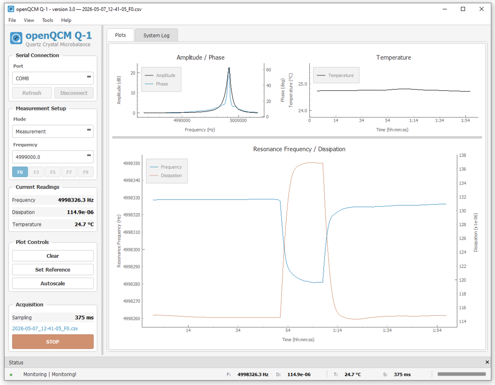

# openQCM Q-1

**Real-time GUI software for the openQCM Q-1 quartz crystal microbalance**

[](https://www.gnu.org/licenses/gpl-3.0)
[](https://www.python.org/)
[]()



An open-source Python application to display, process, and store data in real-time from the [openQCM Q-1](https://openqcm.com/about-openqcm-q-1) device. The software monitors resonance frequency and dissipation variations of a quartz crystal microbalance through real-time analysis of the resonance curve.

---

## Table of Contents

- [About QCM Technology](#about-qcm-technology)
- [Quick Start](#quick-start)
- [Features](#features)
  - [Acquisition and Operating Modes](#acquisition-and-operating-modes)
  - [Visualization and Analysis](#visualization-and-analysis)
  - [Hardware Integration](#hardware-integration)
  - [User Interface](#user-interface)
- [Installation](#installation)
- [Usage](#usage)
- [Project Structure](#project-structure)
- [Architecture](#architecture)
- [Documentation](#documentation)
- [Contributing](#contributing)
- [Citation](#citation)
- [Version History](#version-history)
- [License](#license)
- [Acknowledgements](#acknowledgements)
- [Links](#links)

---

## About QCM Technology

A **Quartz Crystal Microbalance (QCM)** measures mass changes and material properties at the nanoscale by monitoring oscillations in a quartz crystal. When mass is deposited on the crystal surface, the resonance frequency shifts; by tracking frequency and dissipation simultaneously, the technique reveals both the amount of adsorbed material and its viscoelastic properties at molecular scale.

**[openQCM](https://openqcm.com/)** is an open-hardware initiative — powered by Novaetech S.r.l. — built on the principle that high-quality research does not require expensive proprietary instruments. The technology is used in over 50 countries and cited in nearly 300 scientific papers.

The **[openQCM Q-1](https://openqcm.com/about-openqcm-q-1)** is a community-driven QCM instrument for frequency and dissipation monitoring with multiple overtone support (n = 3, 5, 7, 9). It uses an AD8302 RF/IF Gain and Phase Detector with DDS (Direct Digital Synthesis) frequency sweep, pogo-pin sensor contacts, and a plug-and-play USB connection. Applications include protein biosensing, bacteria detection, drug discovery, material science, environmental monitoring, and electrochemistry.

---

## Quick Start

1. Connect the openQCM Q-1 device via USB.
2. Set up the conda environment (one-time):

   ```bash
   cd openQCM_Q-1
   chmod +x setup_env.sh
   ./setup_env.sh
   ```

3. Launch the application:

   ```bash
   conda activate openqcm
   python run.py
   ```

4. In the GUI, select the serial port from the dropdown and click **Connect**.
5. Run **Peak Detection** — the QCM type (5/10 MHz) is auto-detected.
6. Select the desired overtone (F0, F3, F5, F7, or F9) and click **START** to begin acquisition.

For platform-specific notes (Apple Silicon, Linux serial permissions, pip alternative) see [Installation](#installation).

---

## Features

### Acquisition and Operating Modes

**Real-time data acquisition**

- Serial port connection to the openQCM Q-1 device with automatic port detection
- Multiprocessing architecture for non-blocking acquisition and UI rendering
- Support for **5 MHz** and **10 MHz** quartz crystal sensors
- Configurable sampling with multiple overtones (Fundamental, 3rd, 5th, 7th, 9th)

**Dual operating modes**

- **Measurement Mode** — Continuous frequency sweep acquisition with real-time resonance frequency and dissipation tracking.
- **Peak Detection Mode** — Automatic identification of resonance peaks across the full frequency spectrum with QCM type auto-detection and phase cross-validation.

**Data logging**

- Automatic CSV export with millisecond-precision timestamps
- Columns: `Date`, `Time`, `Relative_time`, `Temperature`, `Resonance_Frequency`, `Dissipation`
- Timestamped filenames for organized data management
- Live filename indicator in the sidebar and window title bar during acquisition

### Visualization and Analysis

**Real-time plotting**

- **Amplitude / Phase** sweep (dual Y-axis)
- **Resonance Frequency / Dissipation** time series (dual Y-axis)
- **Temperature** monitoring
- Interactive zoom, pan, auto-scale, and measurement cursors

**Data analysis tools**

- **Raw Data View** — Live visualization of the current frequency sweep with SG-filtered data points (scatter), spline interpolation fit (smooth curve), peak maximum marker, -3 dB bandwidth region highlighting, and real-time Q-factor and dissipation readout.
- **Log Data View** — Load and visualize previously recorded CSV data files.
- **Peak Data View** — Post-calibration diagnostic plots showing amplitude and phase with baseline correction and detected peak markers.
- **Measurement Cursors** — Dual draggable cursors with delta readout for frequency and dissipation.

**Peak detection algorithm**

The peak detection operates in two phases:

1. **Fundamental detection** — Scans the full 1–12 MHz range to locate the fundamental resonance peak using `scipy.signal.argrelextrema`, then auto-detects the QCM type (5 or 10 MHz).
2. **Overtone detection** — Searches for odd harmonics (3rd, 5th, 7th, 9th) in ±400 kHz windows around expected positions, with **phase cross-validation**: overtones are discarded if the magnitude/phase peak frequency difference exceeds a threshold or the phase amplitude is below 10°.

A legacy fallback (`FindPeak`) activates automatically if the new algorithm fails.

### Hardware Integration

**Overtone Quick-Select**

Dedicated buttons (F0, F3, F5, F7, F9) for fast overtone switching with visual feedback — the selected overtone stays highlighted even when buttons are disabled during acquisition.

**Auto-Tracking**

Automatically recalculates the sweep frequency window when the resonance frequency drifts beyond a configurable threshold, ensuring the peak remains centered in the measurement range. A safety hysteresis disables tracking after 10 consecutive sweeps with a missing peak and re-enables it as soon as the signal is recovered.

**Firmware Version Check**

Automatic firmware verification on device connection and manual check via **Help → Check Firmware Version**. Compares the device firmware version (queried via serial command `F`) against the expected version (currently `2.2`). If a mismatch is detected, the application guides the user through a firmware update workflow with integrated launcher for platform-specific updater tools (Teensy.app on macOS, TyUploader.exe on Windows).

### User Interface

- Unified single-window layout with left sidebar (controls), center (plots), and right sidebar (readings)
- **Dark / Light theme** switching optimized for lab environments
- Integrated **System Log** tab with timestamped console messages
- Reference tracking for baseline comparison

---

## Installation

### Requirements

- Python 3.9
- Anaconda or Miniconda
- openQCM Q-1 device connected via USB

### Recommended: automated environment setup

The project includes an automated setup script that creates a conda environment with the exact tested dependency versions. This is the recommended method as it ensures full compatibility across platforms.

```bash
cd openQCM_Q-1
chmod +x setup_env.sh
./setup_env.sh
```

The script automatically:

- Detects your platform (macOS, Linux, Windows) and CPU architecture
- Handles Apple Silicon Macs via Rosetta 2 (x86_64 packages)
- Creates a `openqcm` conda environment with pinned dependency versions
- Verifies the installation

After setup, run the application with:

```bash
/path/to/anaconda3/envs/openqcm/bin/python run.py
```

Or activate the environment first:

```bash
conda activate openqcm
python run.py
```

You can also create the environment directly from the `environment.yml` file:

```bash
conda env create -f environment.yml
```

> **Note for Apple Silicon (M1/M2/M3) users**: the environment uses x86_64 packages via Rosetta 2 for compatibility with PyQt 5.9. Rosetta 2 must be installed on your system.

### Alternative: pip install

```bash
pip install -r requirements.txt
```

Or install individually:

```bash
pip install PyQt5 pyserial pyqtgraph numpy scipy
```

> **Note**: pip install uses the latest available versions, which may cause compatibility issues. The conda environment method above is recommended.

### Linux — serial port permissions

On Linux, grant access to the serial port:

```bash
sudo usermod -a -G dialout $USER
sudo usermod -a -G uucp $USER
```

Log out and log back in for changes to take effect.

---

## Usage

### Run the application

```bash
cd openQCM_Q-1
python run.py
```

Or as a Python module:

```bash
cd openQCM_Q-1
python -m openQCM
```

### Build a standalone executable

```bash
pip install pyinstaller
cd openQCM_Q-1
pyinstaller openQCM_Q-1.spec
```

The executable will be generated in `dist/openQCM_Q-1/`.

---

## Project Structure

```text
openQCM_Q-1/
├── run.py                  # Application entry point
├── setup_env.sh            # Automated conda environment setup
├── environment.yml         # Conda environment specification
├── requirements.txt        # Python dependencies (pip)
├── openQCM_Q-1.spec        # PyInstaller build configuration
├── firmware/               # Teensy firmware source (Arduino .ino)
├── firmware_update/        # Platform-specific firmware update tools
├── openQCM/                # Main Python package
│   ├── app.py              # Application bootstrap
│   ├── core/
│   │   ├── constants.py    # Configuration parameters
│   │   ├── worker.py       # Multiprocessing management
│   │   └── ringBuffer.py   # Circular buffer for time series
│   ├── processors/
│   │   ├── Serial.py       # Device communication and signal processing
│   │   ├── Parser.py       # Data queue distribution
│   │   └── Calibration.py  # Peak detection routines
│   ├── ui/
│   │   ├── mainWindow.py      # Main window controller
│   │   ├── mainWindow_ui.py   # UI layout, stylesheets, and dialogs
│   │   ├── calibrationPlot.py # Peak Detection diagnostic plots
│   │   └── popUp.py           # Notification dialogs
│   ├── common/             # Utilities (logging, file I/O, OS detection)
│   ├── Calibration_5MHz.txt
│   └── Calibration_10MHz.txt
├── tools/                  # Diagnostic CLI scripts (peak detection,
│                           #   overtone analysis, sampling-time monitor)
├── icons/                  # Application icons
├── logged_data/            # CSV data output directory
└── docs/                   # Documentation and reference data
```

---

## Architecture

The application uses a **multiprocessing pipeline** to separate data acquisition from the UI:

```text
+----------------+   Queue 1-6    +----------+    Buffers    +----------------+
| SerialProcess  |--------------->|  Worker  |-------------->|   MainWindow   |
| (child proc.)  |                |          |               | (Qt event loop)|
+----------------+                +----------+               +----------------+
       |                                                              |
       v                                                              v
  Serial Port                                                  PyQtGraph plots
 (openQCM Q-1)                                                   CSV export
```

- **SerialProcess** — Runs in a separate OS process; reads raw ADC data, applies baseline correction, Savitzky-Golay filtering, spline interpolation, and peak/bandwidth computation.
- **Worker** — Consumes multiprocessing queues and stores data in ring buffers.
- **MainWindow** — Qt timer (50 ms) reads buffers and updates plots using efficient `setData()` calls.

---

## Documentation

- [User Guide](docs/USER_GUIDE.md) — *coming soon*: end-user manual covering every feature, dialog, and workflow.
- [CHANGELOG.md](CHANGELOG.md) — Detailed development history of all releases.
- [CONTRIBUTING.md](CONTRIBUTING.md) — How to set up a development environment and submit changes.
- [docs/](docs/) — Reference data, calibration files, and supporting documentation.

---

## Contributing

Contributions are welcome — bug reports, feature requests, and pull requests alike.

For setup instructions, code conventions, and the submission workflow, see [CONTRIBUTING.md](CONTRIBUTING.md).

### Reporting issues

Found a bug or have a feature request? Please open an issue on [GitHub Issues](https://github.com/openQCM/openQCM_Q-1/issues), including:

- Your operating system and Python version
- Steps to reproduce the problem
- Console output or screenshots if applicable
- The firmware version reported by **Help → Check Firmware Version**

---

## Citation

If you use openQCM Q-1 in your research, please cite the software. Citation metadata is also available in machine-readable form in [CITATION.cff](CITATION.cff) and is automatically picked up by GitHub's *"Cite this repository"* feature.

**BibTeX:**

```bibtex
@software{openqcm_q1_2026,
  author    = {Mauro, Marco and {openQCM Team}},
  title     = {{openQCM Q-1}},
  version   = {3.0},
  date      = {2026-05-07},
  url       = {https://github.com/openQCM/openQCM_Q-1},
  publisher = {Novaetech S.r.l.},
  license   = {GPL-3.0}
}
```

**APA:**

> Mauro, M., & openQCM Team / Novaetech S.r.l. (2026). *openQCM Q-1* (Version 3.0) [Computer software]. https://github.com/openQCM/openQCM_Q-1

---

## Version History

| Version | Date | Highlights |
|---------|------|------------|
| **3.0** | May 2026 | • Unified single-window UI with dark/light themes<br>• Two-phase peak detection with QCM auto-detect and phase cross-validation<br>• Auto-tracking with safety hysteresis and sensor-disconnect detection<br>• Raw Data, Peak Data, and Log Data views with measurement cursors<br>• Firmware version check and updater integration |
| 2.1 | 2024 | Calibration optimization, 200 ms plot refresh, macOS/Linux fixes |
| 2.0 | 2020 | Initial Python implementation |

See [CHANGELOG.md](CHANGELOG.md) for detailed development notes.

---

## License

This project is distributed under the [GNU General Public License v3.0](LICENSE).

---

## Acknowledgements

Developed by the [openQCM Team](https://openqcm.com/) at [Novaetech S.r.l.](https://openqcm.com/), with contributions from the open-hardware community.

*Version 3.0 development assisted by [Claude Code](https://claude.ai/).*

---

## Links

- **Website**: [openqcm.com](https://openqcm.com/)
- **Product page**: [openqcm.com/about-openqcm-q-1](https://openqcm.com/about-openqcm-q-1)
- **Repository**: [github.com/openQCM/openQCM_Q-1](https://github.com/openQCM/openQCM_Q-1)
- **Issues**: [github.com/openQCM/openQCM_Q-1/issues](https://github.com/openQCM/openQCM_Q-1/issues)
- **Contact**: [info@openqcm.com](mailto:info@openqcm.com)
